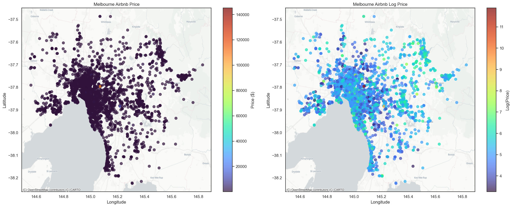

# 🏠 Predicting Airbnb Listing Prices in Melbourne
### Machine Learning Project | Price Prediction with Ensemble Methods

> A machine learning project that develops a reliable price prediction model for Melbourne Airbnb listings, combining extensive feature engineering with stacking and voting ensemble methods to deliver competitive pricing insights.

---

## 🔎 Overview

Airbnb hosts in Melbourne often struggle to set optimal prices, with the platform's own suggestions frequently undervaluing listings. This project builds a data-driven pricing engine using structured listing data, engineered geospatial and textual features, and an ensemble of tuned regression models to predict listing prices with high accuracy.

## 💡 Stakeholders & Benefits
Accurate price predictions offer immense value across multiple verticals:
- **Hosts:** Helps set competitive yet profitable rates, bypassing Airbnb’s often low suggested pricing algorithms.
- **Airbnb Guests:** Provides insights allowing guests to assess whether a listing is fairly priced based on its features, location, and market trends.
- **Property Investors:** Supports data-backed decisions regarding location selection, property attributes, and overall investment assessment.
- **Financial Institutions:** Banks and insurers can leverage these price predictions when assessing loan applications or determining risk factors.

---

## 🗂️ Dataset

The dataset contains Airbnb listing records for Melbourne, Australia, sourced from Inside Airbnb. The combined train and test set spans approximately 6,000 observations and ~100 features covering property details, host attributes, availability, reviews, amenities, and geolocation.

| Item | Detail |
|---|---|
| **Source** | Inside Airbnb (Melbourne) |
| **Target Variable** | `price` (AUD per night) |
| **Observations** | ~6,000 listings |
| **Features** | ~100 (35 numeric, 16 nominal, 1 ordinal, 3 date, 2 geo, 3 text) |
| **Evaluation Metric** | Mean Absolute Error (MAE) on log-transformed price |

---

## 🚀 Getting Started

### Prerequisites

```bash
pip install pandas numpy scikit-learn xgboost lightgbm textblob contextily
```

### Running the Notebook

1. Clone this repository and navigate to the project folder.
2. Place `train.csv` and `test.csv` in the same directory as the notebook.
3. Open `Predicting_Airbnb_Listing_Price_in_Melbourne.ipynb` in Jupyter or Google Colab.
4. Run all cells in order. Note that model tuning (`n_iter=40`, `cv=10`) is computationally intensive — a machine with multiple CPU cores is recommended.

---

### Feature Summary

| Variable Type | Count | Examples |
|---|---|---|
| Numeric | 35 | `LIMIT_BAL`, `accommodates`, `bedrooms`, `review_scores_rating`, `availability_365` |
| Ordinal | 1 | `host_response_time` |
| Nominal | 16 | `room_type`, `property_type`, `neighbourhood_cleansed`, `host_is_superhost` |
| Date | 3 | `host_since`, `first_review`, `last_review` |
| Geo Coordinates | 2 | `latitude`, `longitude` |
| Text | 3 | `description`, `host_about`, `neighborhood_overview` |

---

## 📊 Methodology

### Pipeline Overview

The project follows a structured end-to-end machine learning workflow across four stages.

**Stage 1: Exploratory Data Analysis** (before and after Step 2)
Price distribution analysis (raw and log-scale), univariate profiling of capacity features, missing value assessment across train/test splits, and geospatial mapping of listing prices across Melbourne suburbs.


**Stage 2: Data Cleaning, Transformation & Feature Engineering**
- Cleaning text formatting.
- Standardizing numerical features using `StandardScaler`.
- Encoding high-cardinality nominal features using `OneHotEncoder`.
- Key engineered features include:
  - `cbd_distance_km`: Haversine distance from Melbourne CBD
  - `min_station_distance_km`: Proximity to nearest train station
  - `room_density`: Guests per room ratio
  - `bed_to_bath_ratio`: Group accommodation indicator
  - `num_amenities`: Count of parsed amenities
  - `description_subjectivity`: TextBlob sentiment score on listing description
  - `days_hosting`, `days_since_first_review`: Host related features

**Stage 3: Model Training & Tuning**
- Nine base regressors trained within `sklearn` Pipelines (with `StandardScaler` + `PCA` for linear models). 
- Hyperparameters optimised via `RandomizedSearchCV` with 10-fold cross-validation and `n_iter=40`, scored on negative MAE.

**Stage 4: Ensemble Methods & Final Prediction**
Comparison between 4 ensemble models: Stacking and Voting with top-5 and all-model variants. Final predictions generated on the test set, converted from log-scale back to dollar scale.

---

## 🤖 Models

### Base Regressors

| Model | Notes |
|---|---|
| Linear Regression | Baseline; PCA-reduced features |
| Ridge Regression | L2 regularisation; PCA pipeline |
| Lasso Regression | L1 regularisation; feature selection via sparsity |
| Elastic Net | L1 + L2 combined regularisation |
| Decision Tree | Unpruned; tuned depth and leaf parameters |
| Random Forest | 500–1000 estimators; tuned max depth and features |
| Gradient Boosting | Sequential boosting; tuned learning rate and subsample |
| XGBoost | Regularised gradient boosting; tuned gamma and colsample |
| LightGBM | Leaf-wise boosting; fast and efficient on high-dimensional data |
| Support Vector Regression | RBF kernel; PCA pipeline |

### Ensemble Models

| Ensemble | Base Models | Strategy |
|---|---|---|
| Voting (Top 5) | LightGBM, GBM, RF, XGBoost, SVR | Simple average of predictions |
| Stacking (Top 5) | LightGBM, GBM, RF, XGBoost, SVR | Linear Regression meta-learner |
| Voting (All) | All 10 regressors | Simple average of predictions |
| Stacking (All) | All 10 regressors | Linear Regression meta-learner |


---

## 💡 Key Findings

| Metric | Value |
|---|---|
| Final Model | Stacking Regressor (Top 5) |
| Best Test MAE (log scale) | ~0.22–0.25 |
| Strongest individual predictor | `accommodates` (Spearman r = 0.63) |
| Top ensemble contributor | LightGBM (meta-weight: 0.61) |
| XGBoost meta-weight | −0.23 (correction term) |

- 🏡 **Capacity drives price**: `accommodates`, `bedrooms`, `beds`, and `bathrooms` are the dominant predictors across all models. Physical scale is the single strongest baseline price signal.
- 📍 **Location matters**: `cbd_distance_km` and `review_scores_location` consistently appear in top feature importance rankings, confirming that CBD proximity commands a measurable price premium.
- 🔧 **Engineered features add signal**: `room_density`, `bed_to_bath_ratio`, `description_subjectivity`, and `min_station_distance_km` contribute meaningfully across multiple base models, validating the feature engineering process.
- 🎯 **Ensemble diversity is a strength**: LightGBM learns from host behaviour and listing presentation; RF, GBM, and XGBoost focus on structural attributes. This divergence is why combining them outperforms any single model.
- 📉 **Log transformation is essential**: The raw price distribution is extremely right-skewed, compressing ~6,000 observations into a single histogram bar. Log transformation produces a near-normal distribution and substantially improves model performance.
- ⚠️ **XGBoost acts as a corrector**: The meta-learner assigns XGBoost a negative weight (−0.23), using it to subtract correlated errors from the other base models rather than as a direct contributor.

---

## 📌 Model Performance Summary

Rankings based on average of MAE_train rank and MAE_test rank across all 14 models (9 base regressors + 4 ensembles + linear regression baseline):

- 🥇 **stacking_top_five** and **stacking_all** tied at average rank 1.5
- 🥈 Gradient Boosting, LightGBM, and Random Forest led among individual regressors (test MAE ~0.22–0.25)
- 🔻 Lasso, Ridge, and Linear Regression significantly underfit, confirming the nonlinear complexity of Airbnb pricing

---

## 🛠️ Tools & Technologies

- **Python**: pandas, NumPy, scikit-learn
- **Geospatial**: Contextily (basemaps), Haversine distance
- **NLP**: TextBlob (sentiment scoring on listing descriptions)
- **Machine Learning Modelling**: sklearn Pipelines, RandomizedSearchCV, StackingRegressor, VotingRegressor
- **Visualisation**: Matplotlib, Seaborn

---

## Author
Prepared by: Gia Bao Hoang

---

*Dataset sourced from Inside Airbnb (Melbourne). All analyses are conducted for research and educational purposes.*
